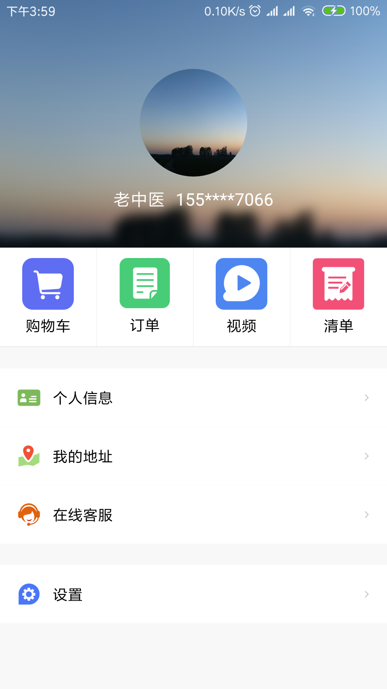
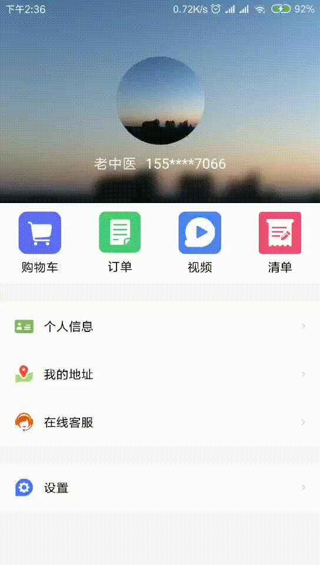

# 使用揭露动画实现Activity另类的跳转

> 该动画目前仅支持5.0以上,文中使用了几个库，主要用于辅助操作，跟动画毫无关系


平常我们的 Activity 跳转都是默认动画，或者我们自定义的转场动画，5.0以上对转场动画进行了更新，效果大大提升，最近又发现一个 View 的动画 **Circular Reveal** ，注意，是作用于 View 的，但是这也不能阻挡我们使用在 Activity 转场上啊，毕竟人的操作才是最骚气的。下面我们来看一下怎么作用于 Activity 的转场上。


### 当前 Demo 所使用的库

- Glide 加载图片

  ```groovy
  implementation 'com.github.bumptech.glide:glide:4.7.1'
  kapt "com.github.bumptech.glide:compiler:4.7.1"
  ```

- Palette 用于吸取图片色值

  ```groovy
  implementation 'com.android.support:palette-v7:28.0.0-alpha3'
  ```

- CircleImageView 圆形头像

  ```groovy
  implementation 'de.hdodenhof:circleimageview:2.2.0'
  ```

- EasyBlur 高斯模糊封装

  ```groovy
   implementation 'com.github.pinguo-zhouwei:EasyBlur:v1.0.0'
  ```

### 准备工作

没什么要准备的，先写个界面吧，代码太多影响观感小的这就把源码双手奉上，[点击跳转到源码](https://github.com/lmyDevs/circularRevealAnimator)，界面效果如下，这界面想必实现起来应该没有任何难题吧，源码就不放了自己写就行了。



首先还是需要先简单去看一下 CircularReveal 动画如何作用于 View 上，然后我们再进行下面的操作，本篇文章仅介绍如何用作 Activity 的转场动画，不介绍 CircularReveal 的使用。

### 实现效果

废话不多说，开始干活，我就不分步来做了，虽然很详细但是实在是太啰嗦了，直接来实现最终的效果，先上图，GIF 太渣，有转换的高清的，但是图太大了，不合适



我们就是要实现这个效果，我们这里是不针对单个 Activity 跳转的，所以我们要新建一个 BaseActivity 来统一给所有 Activity 加上该效果。

> 主要实现逻辑：
>
> ​	我们的动画逻辑主要是在目标 Activity 之中，在触发的 Activity 之中仅仅告诉目标 Activity 需不需要启动该动画，然后把动画的起始点 X，Y 坐标，还有传递给目标 Activity 揭露动画的颜色，基本上所有的操作都在目标 Activity 之中，目标 Activity 需要在 setContentView 之中开始揭露动画，这样我们的动画看上去很自然，没有生硬的切换动画。我们还需要在目标 Activity finish之前执行返回的动画，有始有终，比较和谐。

**注意源码中的主题**

- 先在 BaseActivity 之中定义好触发 Activity 的要使用的 Key

```kotlin
 companion object {
        // 坐标值
        const val REVEAL_POINT_Y = "reveal_y"
        const val REVEAL_POINT_X = "reveal_x"
        // 动画中的色值
        const val REVEAL_COLOR_START = "color_start"
 }
```

- 在 onCreate() 中 setContentView() 之前设置状态栏为透明（可以删掉查看动画效果）

```kotlin
private var point = arrayListOf<Int>() // 坐标点合集
private var colorReveal = 0 // 动画的色值
override fun onCreate(savedInstanceState: Bundle?) {
        super.onCreate(savedInstanceState)
        if (Build.VERSION.SDK_INT >= Build.VERSION_CODES.LOLLIPOP) {
            window.addFlags(WindowManager.LayoutParams.FLAG_TRANSLUCENT_STATUS)
         	window.requestFeature(Window.FEATURE_CONTENT_TRANSITIONS)
        }
        getIntentPointDot(intent)
    }
```

- getIntentPointDot(intent) 是个啥？

```kotlin
private fun getIntentPointDot(intent: Intent) {
        val extraY = intent.getIntExtra(REVEAL_POINT_Y, 0)
        val extraX = intent.getIntExtra(REVEAL_POINT_X, 0)
        if (Build.VERSION.SDK_INT >= Build.VERSION_CODES.LOLLIPOP) {
            colorReveal = intent.getIntExtra(REVEAL_COLOR_START,ContextCompat.getColor(this, R.color.colorAccent))
            // 清除坐标合集，确保数据不会错乱
            point.clear()
            // 确保数据值为默认值，都是0就认为不开启动画
            if ((extraX != 0) or (extraY != 0)) {
                point.add(extraX)
                point.add(extraY)
            }
        }
    }
```


#### 启动动画

- 基本数据获取完，重写 setContentView() 方法，添加视图树预加载监听，在监听中执行动画，这个视觉上比较顺畅

```kotlin
override fun setContentView(layoutResID: Int) {
        val view = LayoutInflater.from(this).inflate(layoutResID, null)
        setContentView(view)
    }

    override fun setContentView(view: View) {
        super.setContentView(view)
        // 只有在有坐标值的时候才执行动画
        if ((point.size >= 2) and (Build.VERSION.SDK_INT >= Build.VERSION_CODES.LOLLIPOP)) {
			// 使用 decorView 的原因是因为我们要作用到整个屏幕，包括状态栏，这样视觉效果很好
        	val decorView = window.decorView as ViewGroup
        	// 创建一个 View 放到 decorView 中用于设置背景颜色，填充执行动画的时候的背景，动画默认是透明背景的
        	val view1 = View(this)

            view1.layoutParams = FrameLayout.LayoutParams(FrameLayout.LayoutParams.MATCH_PARENT, FrameLayout.LayoutParams.MATCH_PARENT)
            // 给View设置背景色填充动画执行时的颜色
            view1.setBackgroundColor(colorReveal)
            decorView.addView(view1)
        }
        // 添加视图树预加载监听，在第一次加载时再执行动画，直接执行会出异常。
        decorView.viewTreeObserver.addOnPreDrawListener(object : ViewTreeObserver.OnPreDrawListener {
            override fun onPreDraw(): Boolean {
                // 需要在该回调方法中移除监听，否则会收到多次监听回调，这样动画就重复执行了
                decorView.viewTreeObserver.removeOnPreDrawListener(this)
                // 创建揭露动画，false 表示是start的动画而不是finish的动画
                val animator = createRevealAnimator(false, decorView)
                animator.interpolator = AccelerateDecelerateInterpolator()
                animator.duration = 700
                // 当前动画是从动画执行时的颜色改变到透明色，用作动画执行完成之后逐渐恢复应有界面而不是立刻
                val valueAnimator = ValueAnimator.ofObject(ArgbEvaluator(), colorReveal, Color.TRANSPARENT)
                valueAnimator.duration = 500
                valueAnimator.addUpdateListener {
                     // 在监听里面设置当前进度所产生的色值
                     view1.setBackgroundColor(it.animatedValue as Int)
                }

                val animatorSet = AnimatorSet()
                // 顺序执行，也可以把 before 改成 with 同时执行看看效果，同时执行的话推荐两个动画的时长设置成相同的
                animatorSet.play(animator).before(valueAnimator)
                animatorSet.addListener(object : AnimatorListenerAdapter() {
                    override fun onAnimationEnd(animation: Animator?) {
                         super.onAnimationEnd(animation)
                         // 动画执行完毕 view1 这个View已经是不需要的了，没必要再留在decorView里面
                         decorView.removeView(view1)
                    }
                })
                
                animatorSet.start()
                return false
            }
        })
    }
```

- 啥是 createRevealAnimator() ？

```kotlin
    @RequiresApi(Build.VERSION_CODES.LOLLIPOP)
    private fun createRevealAnimator(isFinish: Boolean, view: View): Animator {
        val hypo = Math.hypot(view.height.toDouble(), view.width.toDouble())
        val startRadius = if (isFinish) hypo.toFloat() else 0f
        val endRadius = if (isFinish) 0f else hypo.toFloat()
        // 创建揭露动画，view是作用目标，point[0] 和 point[1]，是x，y坐标是放大开始的坐标也是缩小结束的坐标
        val animator = ViewAnimationUtils.createCircularReveal(view, point[0], point[1], startRadius, endRadius)
        animator.duration = 500
        return animator
    }
```


到这里启动动画就已经完成了，可以先看看效果了，下面我们来实现 finish() 动画，这样看起来就更顺畅了


#### 结束动画

- finish 动画就要多监听几个方法了

我们常使用到的就是 finish() , onBackPressed() ,两个方法， supportFinishAfterTransition() 这个方法可以单独搜一下是有什么不同。

```kotlin
    override fun finish() {
		// 如果坐标点是空就执行正常的 finish 方法，下面两个方法同理
        if (point.size >= 2) {
            finishAnimator(1)
        } else {
            super.finish()
        }
    }

    override fun supportFinishAfterTransition() {
        if (point.size >= 2) {
            finishAnimator(2)
        } else {
            super.supportFinishAfterTransition()
        }
    }

    override fun onBackPressed() {
        if (point.size >= 2) {
            finishAnimator(3)
        } else {
            super.onBackPressed()
        }

    }
```

- finishAnimator() 里面是啥？

实现方式还是跟启动的时候差不多。只是我们是 finish 并且多个 finish 的方法，所以传个 index 值以便区分

```kotlin
 private fun finishAnimator(index: Int) {
        if ((point.size >= 2) and (Build.VERSION.SDK_INT >= Build.VERSION_CODES.LOLLIPOP)) {
            val decorView = window.decorView as ViewGroup
            val view1 = View(this)
            decorView.addView(view1)
            // 给View设置背景色填充动画执行时的颜色
            view1.setBackgroundColor(colorReveal)
            // 创建 finish 动画，参数传 true
            val animator = createRevealAnimator(true, decorView)
            animator.interpolator = AccelerateDecelerateInterpolator()
            animator.duration = 600

            val animatorSet = AnimatorSet()
            animatorSet.play(animator)
            animatorSet.addListener(object : AnimatorListenerAdapter() {
                override fun onAnimationEnd(animation: Animator?) {
                    super.onAnimationEnd(animation)
                    // 动画执行完毕直接把 decorView 设置成透明，这样 Activity finish 时的默认动画就看不到了
                    decorView.alpha = 0f
                    // view1 没用了，删掉
                    decorView.removeView(view1)
                    // 把坐标点清除，再次调用 finish 方法退出当前 activity, finish 方法中已做校验
                    point.clear()
                    // 根据传的 index 调用不同的 finish 方法。
                    when (index) {
                        1 -> finish()
                        2 -> supportFinishAfterTransition()
                        3 -> onBackPressed()
                    }
                }
            })
            animatorSet.start()
        }
 }
```


好了，关闭动画也完成了，效果看不了啊，因为我们还没弄启动的触发啊。


#### 触发动画

触发动画，直接把上面定义好的值传过去就行了，不过我们得先获取值才能传啊。

```kotlin
            val intentActivityReveal = intentActivityReveal(viewSetting, OrderManagerActivity::class.java)
            startActivity(intentActivityReveal, ActivityOptionsCompat.makeSceneTransitionAnimation(this).toBundle())
```

就是这两句，intentActivityReveal() 是个 Kotlin 的扩展方法，请勿吐槽这个方法名，我不会英语。。。


- intentActivityReveal() 方法里是啥？

```kotlin
/**
 * 使用揭露动画启动activity
 */
fun Activity.intentActivityReveal(view: View, clazz: Class<*>): Intent {
    return initIntent(this, view, clazz)
}

/**
 * 使用揭露动画启动activity
 */
fun Fragment.intentActivityReveal(view: View, clazz: Class<*>): Intent {
    return initIntent(activity!!, view, clazz)
}
```

就是这个，我是真的皮，-__-


- initIntent()

```kotlin
private fun initIntent(activity: Activity, view: View, clazz: Class<*>): Intent {

    val location = IntArray(2)
    view.getLocationOnScreen(location)

    var rgb = ContextCompat.getColor(activity, R.color.colorAccent)
    try {

        if (view is ImageView) {
            val drawable = view.drawable as BitmapDrawable
            
            // 使用 Palette 来吸取图片的主要色值
            val palette = Palette.from(drawable.bitmap)
            val generate = palette.generate()
            rgb = getRgb(generate, activity)

            location[0] = location[0] + view.width / 2
        } else {
            val background = view.background
            if (background is BitmapDrawable) {
                val palette = Palette.from(background.bitmap)
                val generate = palette.generate()
                getRgb(generate, activity)

                location[0] = location[0] + view.width / 2

            } else if (background is ColorDrawable) {
                rgb = if (view is TextView) {
                    if (view.compoundDrawables.isNotEmpty()) {
                        val bitmapDrawable = when {
                            view.compoundDrawables[0] != null -> {
                                location[0] = view.paddingLeft + view.compoundDrawablePadding
                                view.compoundDrawables[0] as BitmapDrawable
                            }
                            view.compoundDrawables[1] != null -> {
                                location[0] = location[0] + view.width / 2
                                view.compoundDrawables[1] as BitmapDrawable
                            }
                            view.compoundDrawables[2] != null -> {
                                location[0] = view.paddingRight + view.compoundDrawablePadding
                                view.compoundDrawables[2] as BitmapDrawable
                            }
                            view.compoundDrawables[3] != null -> {
                                location[0] = location[0] + view.width / 2
                                view.compoundDrawables[3] as BitmapDrawable
                            }
                            else -> {
                                BitmapDrawable()
                            }
                        }

                        val palette = Palette.from(bitmapDrawable.bitmap)
                        val generate = palette.generate()
                        getRgb(generate, activity)
                    } else {
                        background.color
                    }

                } else {
                    background.color
                }
            }
        }

    } catch (e: Exception) {
        Log.e("lmy", "没有读取到颜色或者背景转换失败了")
    }

    val intent = Intent(activity, clazz)
    intent.putExtra(BaseActivity.REVEAL_POINT_X, location[0])
    intent.putExtra(BaseActivity.REVEAL_POINT_Y, location[1] + (view.height / 2))
    intent.putExtra(BaseActivity.REVEAL_COLOR_START, rgb)
    return intent
}
```

原谅我这么垃圾的代码，主要以实现效果为主，请尽量忽略，使用 Palette 来吸取图片的主要色值，获取 x ，y 坐标，计算 view 的中心点，如果是 TextView 的话，获取 drawableTop 等属性设置的图片。如果有背景就获取图片的背景色，判断不完美敬请谅解。


- getRgb()

```kotlin
private fun getRgb(palette: Palette, activity: Activity): Int {

    return when {
        palette.lightVibrantSwatch != null -> {
            palette.lightVibrantSwatch?.rgb!!
        }
        palette.lightMutedSwatch != null -> {
            palette.lightMutedSwatch?.rgb!!
        }
        palette.vibrantSwatch != null -> {
            palette.vibrantSwatch?.rgb!!
        }
        palette.darkVibrantSwatch != null -> {
            palette.darkVibrantSwatch?.rgb!!
        }
        palette.darkMutedSwatch != null -> {
            palette.darkMutedSwatch?.rgb!!
        }
        palette.dominantSwatch != null -> {
            palette.dominantSwatch?.rgb!!
        }
        else -> {
            ContextCompat.getColor(activity, R.color.colorAccent)
        }
    }
}
```

因为 Palette 也不能保证能够拿到你所需要的值，所有有可能为空。


这就结束了，这么多代码很影响观感，没办法，以后直接弄截图试试。如果出现错误啥的请对比一下源码，如果源码有啥错误的话，请告诉我，我就看看，不改。